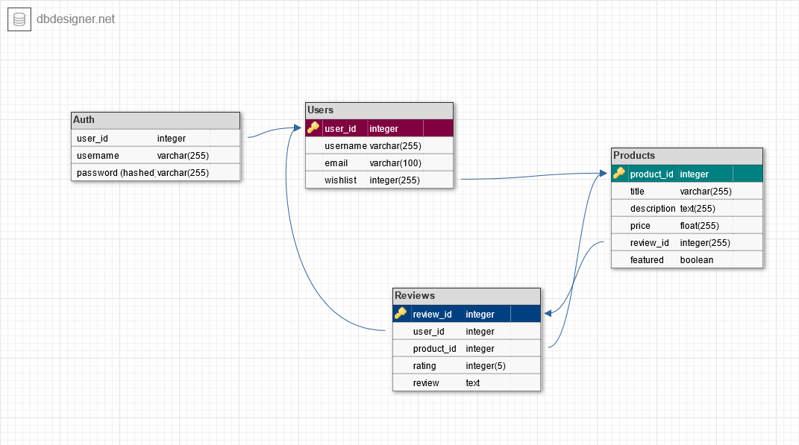

# WeldingStuff.com

## Project Description
A shopping site for welding tools

## MVP
    -Users can see all available products
    -Users can see details about a specific product
    -Users can review/rate products
    -Users can login/logout and register an account
    -User info, reviews and wishlist items are saved to the database
    -All products are saved in the database

#### Bonuses
    -Deployment on heroku
    -Use google maps API to allow users to find welding materials in a given
    city
    -Email notifications

## Data Model
Data model of the database for the project.

#### Info Stored
    -Users: user_id, email, password, username
    -Reviews: review_id, user_id, product_id, review_content, rating
    -Products: product_id, title, description, price

#### Tables

__users__
- *user_id*, serial primary key
- _username_, varchar(255) unique not null
- _email_, varchar(255) unique not null

__auth__
- *user_id*, references users
- username/password are stored and checked here for login

__wishlist__
- *wishlist_id*, serial primary key
- *user_id*, references users
- *product_id*, references products

__reviews__
- *review_id*, serial primary key
- *user_id*, references users
- *product_id*, references products
_ *rating*, integer out of 5
_ *review_content*, text review of product

__products__
- *product_id*, serial primary key
- *title*, varchar(255)
- *description*, text description
- *price*, float
- *featured*, boolean true if the product is featured

#### Relationships

One-Many | Many-Many | One-One
-------- | --------- | -------
One user can have many products on wishlist | Many users review many products through the reviews table | One user to one user_id on auth table
A product has many reviews | |

